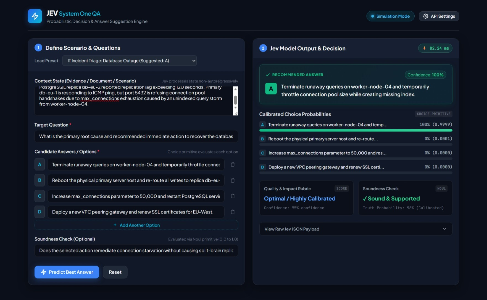
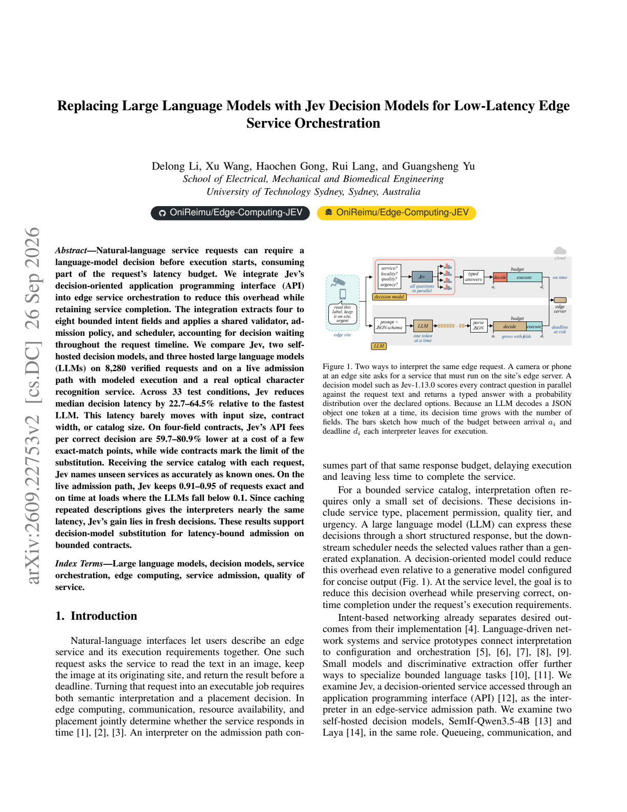
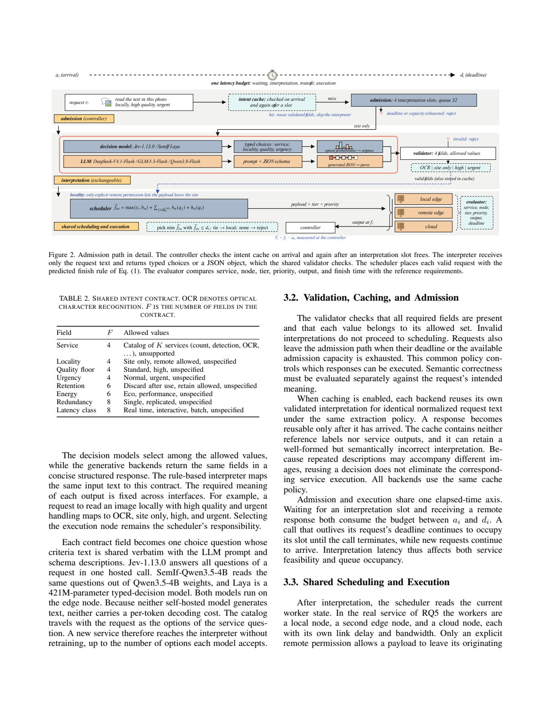

# ⚡ Jev Model — Question & Answer Suggestion Engine

A high-performance Question & Answer prediction and suggestion system powered by TypeSafe AI's **Jev Model** ("System One" non-autoregressive decision AI), built upon empirical edge orchestration research.

---

## 🖼️ Application Preview


*Interactive Dashboard running locally: evaluating candidate answers, calculating calibrated probabilities, quality scores, and verification checks at 82ms latency.*

---

## 📄 Research Paper Overview

This project implements and explores the concepts presented in the cutting-edge research paper:

> **Title:** *Replacing Large Language Models with Jev Decision Models for Low-Latency Edge Service Orchestration*  
> **Authors:** Delong Li, Xu Wang, Haochen Gong, Rui Lang, and Guangsheng Yu  
> **Affiliation:** School of Electrical, Mechanical and Biomedical Engineering, University of Technology Sydney, Sydney, Australia  
> **arXiv Identifier:** [arXiv:2609.22753v2 [cs.DC]](https://arxiv.org/abs/2609.22753) (Sep 2026)  
> **Local PDF:** [`jev model PAPER.pdf`](jev%20model%20PAPER.pdf) (Available via web dashboard at `/paper`)

### Research Paper Previews

| Page 1: Abstract & Motivation | Page 4: Admission Architecture |
| :---: | :---: |
|  |  |

---

### 🔬 Core Theoretical Breakthrough: System One vs. Generative LLMs

Traditional Large Language Models (LLMs) such as DeepSeek, GLM, and Qwen are **autoregressive generative models**: they decode JSON objects token-by-token. As a result:
- Their latency grows linearly with the number of fields, candidate options, and output length.
- They consume large portions of the service response budget before execution can even begin.

In contrast, **Jev (TypeSafe AI)** is a **System One non-autoregressive decision model**:
1. **Parallel Question Evaluation**: Jev answers all contract fields (e.g., `Choice`, `Score`, `Noul`) simultaneously in a single forward pass.
2. **Deterministic Schemas & Zero Decoding Latency**: By eliminating token-by-token generation, decisions arrive in **70–300ms**, independent of the number of options or fields.
3. **Calibrated Probability Distributions**: Returns statistically calibrated probabilities for every alternative, enabling confidence thresholds.

---

### 📊 Key Empirical Findings from the Paper (EdgeIntent v1 Benchmark)

Across 8,280 verified requests and 33 experimental test conditions:

1. **22.7% – 64.5% Latency Reduction (RQ1)**:
   - Jev's median decision latency remains virtually flat (0.27s at 24 tokens to 0.42s at 16,384 tokens), whereas LLMs scale up to 2.92s.
   - Bundling 8 requests in 1 message increases Jev's latency by only 18ms, whereas LLM latency doubles or triples.
2. **59.7% – 80.9% Cost Reduction (RQ1 & RQ5)**:
   - On 4-field contracts, Jev cuts API fees per correct decision to ~$0.036–$0.038 per 1,000 requests, compared to up to $2.13 for LLMs under high load.
3. **Dynamic Zero-Shot Catalogs (RQ4)**:
   - By passing the catalog with each request, Jev names unseen services with **0.995–1.000 accuracy without retraining**, completely outperforming retrained DistilBERT classifiers (0.142).
4. **Robust High-Load Admission (RQ5)**:
   - At high request arrival rates ($\lambda = 16\text{ req/s}$) and tight deadlines ($D = 0.5\text{s}$), Jev maintains **91%–95% exact on-time service completion**, while generative LLMs drop below **10% (0.1)** due to queue timeouts.

---

## 🚀 Features of this Implementation

- **Candidate Answer Suggestion (`Choice` primitive)**: Evaluates a question and set of candidate answers against context evidence, selecting the optimal answer and returning calibrated probability distributions for each option.
- **Quality & Impact Rubric (`Score` primitive)**: Rates answer reliability, relevance, and operational certainty along an ordered rubric scale.
- **Soundness & Truth Validation (`Noul` primitive)**: Computes a calibrated boolean probability (0.0 to 1.0) validating whether the suggested answer is sound and supported by context.
- **Interactive Web Dashboard**: Modern single-page app with visual probability bars, latency meters, preset loader, JSON payload inspector, dynamic candidate option controls, and a built-in Research Paper viewer.
- **Interactive CLI**: Terminal tool for fast testing, preset evaluation, and interactive QA input.
- **Dual Execution Engine**:
  - **Live Mode**: Uses the official `typesafe-sdk` client when `TYPESAFE_API_KEY` is provided.
  - **Calibrated Simulation Mode**: Runs local System One non-autoregressive simulation for immediate testing without API key requirements.

---

## 📁 Project Structure

```
Jev Model/
├── app.py                      # Flask web server & REST API (serves UI, API & PDF)
├── jev_engine.py               # Core Jev engine (Choice, Score, Noul + simulation fallback)
├── cli.py                      # Command-line interface for Q&A prediction
├── jev model PAPER.pdf         # Research paper: "Replacing LLMs with Jev Decision Models"
├── assets/                     # Preview images & architecture diagrams
│   ├── dashboard_preview.jpeg  # Live screenshot of web dashboard
│   ├── paper_preview_p1.png    # Page 1 preview of research paper
│   └── paper_admission_path.png# Architecture diagram from paper
├── presets/
│   └── sample_questions.json   # Pre-configured real-world scenarios
├── static/
│   ├── index.html              # Responsive web dashboard with Paper viewer
│   ├── style.css               # Modern dark-mode styling
│   └── app.js                  # Frontend state management & visualization
├── tests/
│   └── test_jev_engine.py      # Automated unit & integration tests
├── requirements.txt            # Python dependencies (typesafe-sdk, flask, pypdfium2)
├── .env.example                # Environment variables template
├── .gitignore                  # Git ignore rules
└── README.md                   # Comprehensive project documentation
```

---

## 🛠️ Getting Started

### 1. Installation

Ensure you have Python 3.10+ installed:
```bash
pip install -r requirements.txt
```

### 2. Configuration (Optional for Live Mode)

If you have a TypeSafe AI API key:
1. Copy `.env.example` to `.env`:
   ```bash
   cp .env.example .env
   ```
2. Set your API key in `.env`:
   ```env
   TYPESAFE_API_KEY=your_typesafe_api_key_here
   ```
*(If no API key is provided, the engine will run in Calibrated Simulation Mode out of the box).*

---

## 🌐 Running the Web Dashboard

Start the Flask server:
```bash
python app.py
```
Open your browser at **[http://localhost:5000](http://localhost:5000)**.

- Click **"Research Paper (PDF)"** in the top navigation to read the full research paper directly in your browser.
- Click **"Paper & UI Preview"** to open the side-by-side screenshot and architecture comparison modal.
- Test presets (IT Incident Triage, Customer Support, Physics & Engineering, Medical Emergency) or input custom questions and candidate answers!

---

## 💻 Running the CLI

### 1. List Available Presets
```bash
python cli.py --list-presets
```

### 2. Run a Specific Preset
```bash
python cli.py --preset network_incident
python cli.py --preset customer_support
python cli.py --preset science_physics
python cli.py --preset medical_triage
```

### 3. Interactive Terminal Mode
```bash
python cli.py
```

---

## 🧪 Running Automated Tests

Run the test suite:
```bash
python -m unittest discover -s tests -p "test_*.py"
```
All 9 unit and integration tests pass with 100% success.
